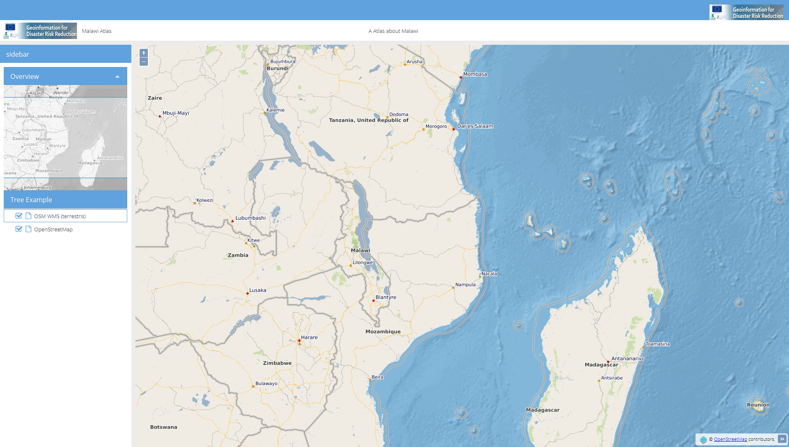

# HelloGeoExt

This a prototype of a GeoExt application. Initially created with [this instruction](https://github.com/geoext/geoext3/blob/master/universal-app.md).

# How to run:

```shell
sencha app install
sencha app watch
```

Only tested on `Windows 10` with `Sencha Cmd v6.5` and `Ext JS 6.2 (GPL)` so far. But should run on Linux or Mac as well. 

Screenshot:



# Autogenerated README

This folder is primarily a container for the top-level pieces of the application.
While you can remove some files and folders that this application does not use,
be sure to read below before deciding what can be deleted and what needs to be
kept in source control.

The following files are all needed to build and load the application.

 - `"app.json"` - The application descriptor which controls how the application is
   built and loaded.
 - `"app.js"` - The file that launches the application. This is primarily used to
   launch an instance of the `MyApp.Application` class.
 - `"index.html"` - The default web page for this application. This can be customized
   in `"app.json"`.
 - `"build.xml"` - The entry point for Sencha Cmd to access the generated build
   script. This file is a place where you can hook into these processes and tune
   them. See the comments in that file for more information.
 - `".sencha"` - This (typically hidden) folder contains the generated build scripts
   and configuration files for the application. This folder is required in order to
   build the application but its content should not need to be edited in most cases.
   The content of this folder is updated by "sencha app upgrade".

These files can be ignored from source control as they are regenerated by the build
process.

 - `"build"` - This folder contain the output of the build. The generated CSS file,
   consolidated resources and concatenated JavaScript file are all stored in this
   folder.
 - `"bootstrap.*"` - These files are generated by the build and watch commands to
   enable the application to load in "development mode".

# Other Folders

## Basic Application Structure

Applications that target a single toolkit will have the following structure.

    app/                # Contains JavaScript code
        model/          # Data model classes
        view/           # Views as well as ViewModels and ViewControllers
        store/          # Data stores
        controller/     # Global / application-level controllers

    overrides/          # JavaScript code that is automatically required

    sass/
        etc/            # Misc Sass code (all.scss is imported by default)
        var/            # Sass variable and mixin declarations
        src/            # Sass rules

    resources/          # Assets such as images, fonts, etc.

See the [Sass readme](sass/Readme.md) for details on the "sass" folder.

## Universal Applications

In a Universal Application, the basic application structure above is retained but
only holds code, resources, etc. pieces that are used in both classic and modern
build profiles. The following additional directories are used to isolate code and
other files that are toolkit-specific:

    classic/                # Content specific to the classic toolkit
        src/
            model/          # Data model classes
            view/           # Views as well as ViewModels and ViewControllers
            store/          # Data stores
            controller/     # Global / application-level controllers

        overrides/          # JavaScript code that is automatically required

        sass/
            etc/            # Misc Sass code (all.scss is imported by default)
            var/            # Sass variable and mixin declarations
            src/            # Sass rules

        resources/          # Assets such as images, fonts, etc.

    modern/                 # Content specific to the modern toolkit
        src/
            model/          # Data model classes
            view/           # Views as well as ViewModels and ViewControllers
            store/          # Data stores
            controller/     # Global / application-level controllers

        overrides/          # JavaScript code that is automatically required

        sass/
            etc/            # Misc Sass code (all.scss is imported by default)
            var/            # Sass variable and mixin declarations
            src/            # Sass rules

        resources/          # Assets such as images, fonts, etc.

## Overrides

The contents of "overrides" folders are automatically required and included in
builds. These should not be explicitly mentioned in "requires" or "uses" in code.
This area is intended for overrides like these:

    Ext.define('MalawiAtlas.overrides.foo.Bar', {
        override: 'Ext.foo.Bar',
        ...
    });

Such overrides, while automatically required, will only be included if their target
class ("Ext.foo.Bar" in this case) is also required. This simplifies applying
patches or extensions to other classes.
